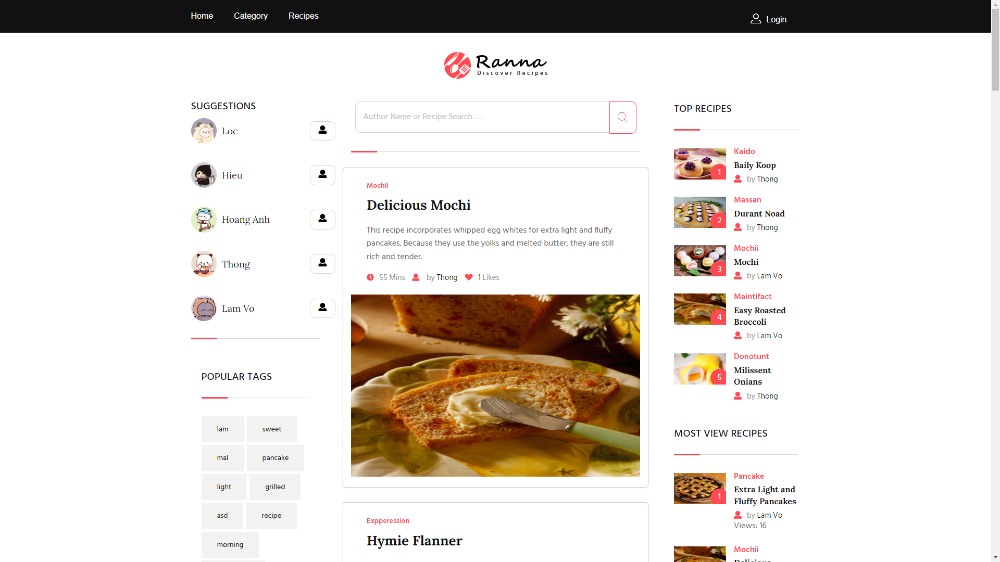
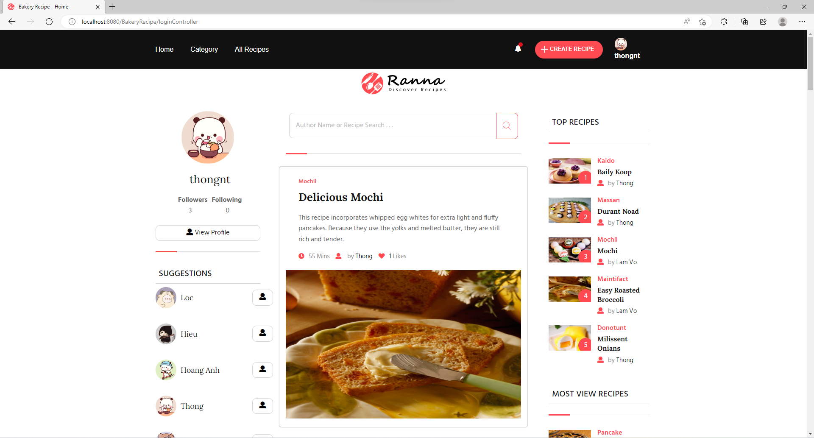
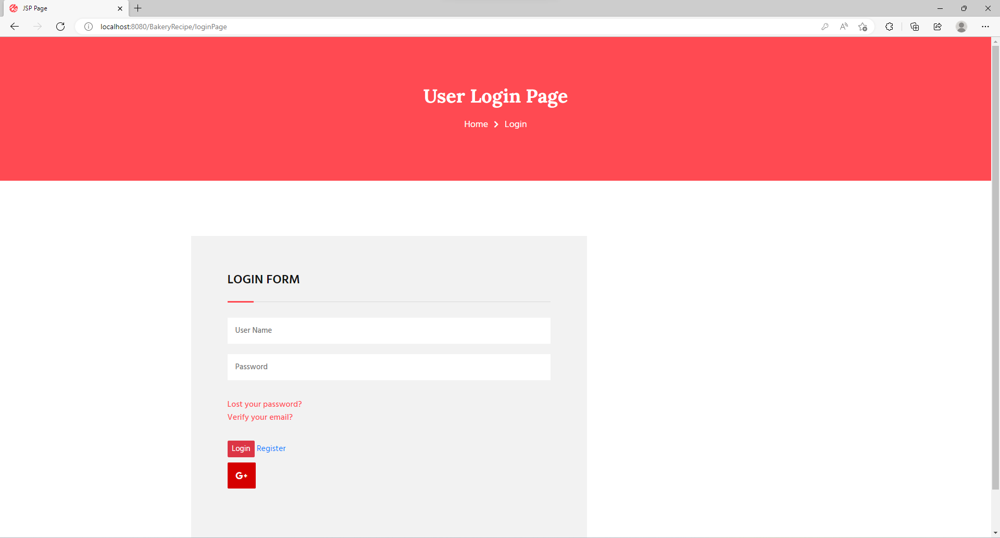
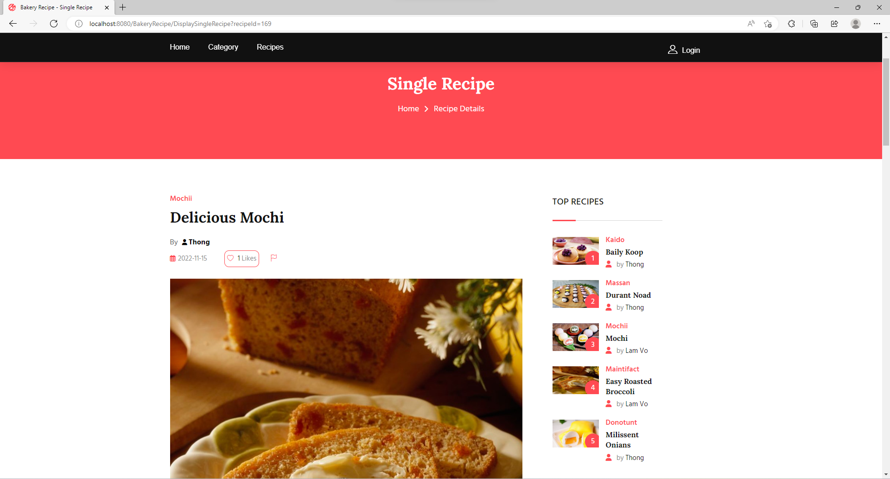
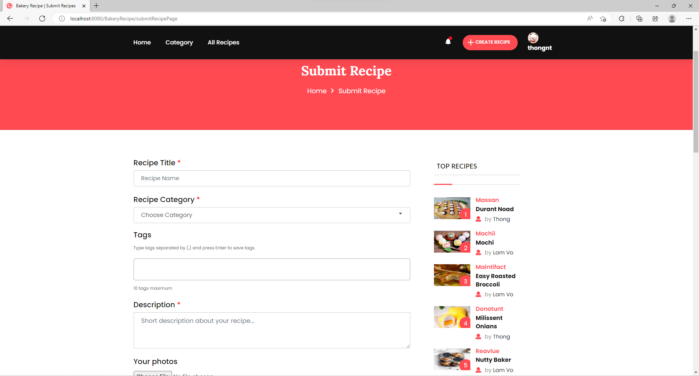
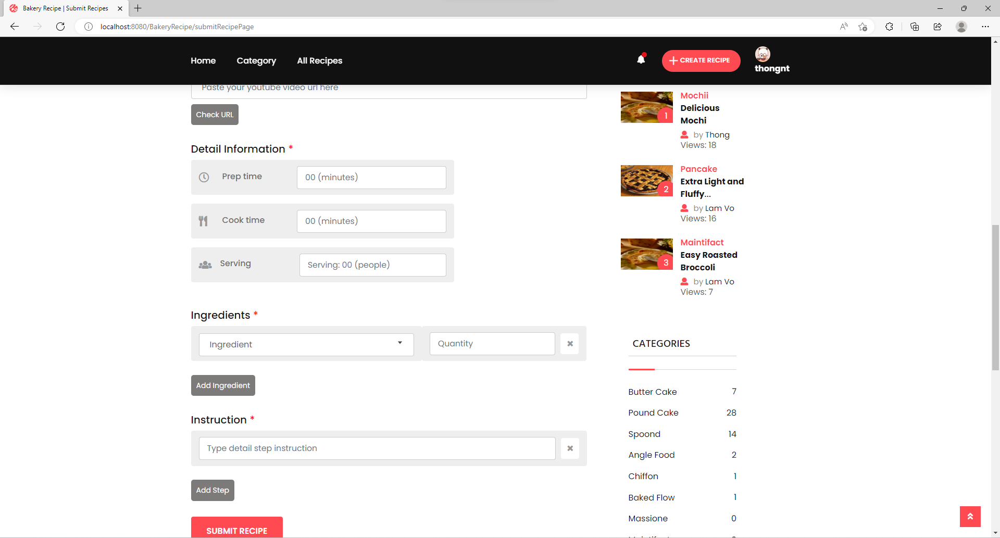
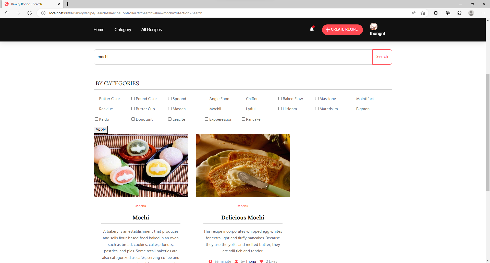
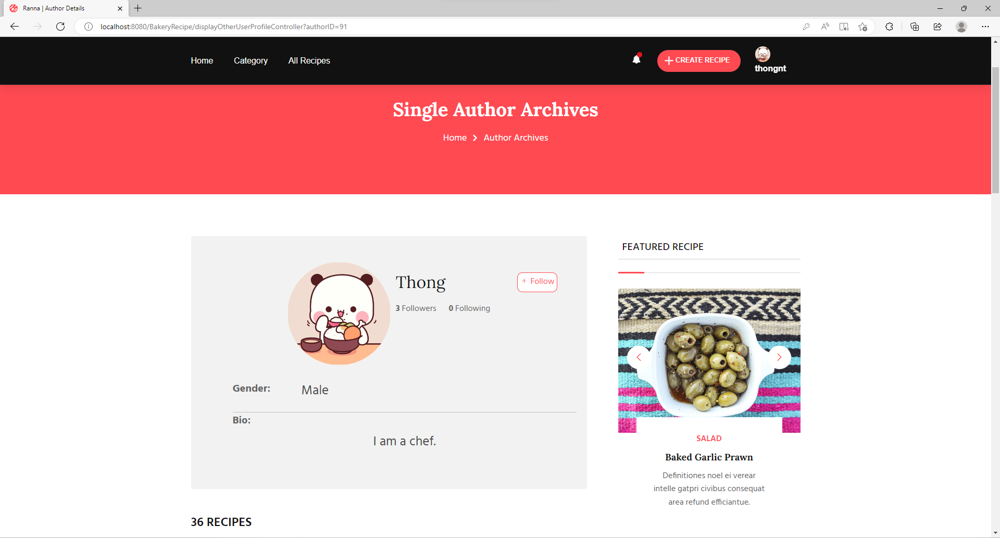

# COOKING RECIPE SHARING WEBAPP

:wave: Welcome to our Software Development Project (SWP391) :wave:

## Table of Contents
  - [Description](#description)
  - [Preview Screenshot](#preview-screenshot)
  - [Technology](#technology)
  - [Functional requirements](#functional-requirements)
  - [Useful Resources](#useful-resources)
  - [Contributors](#contributors)
  - [References](#references)
  - [License & Copyright](#license--copyright)

## Description
- This is a website to publish the graduation projects of Software Development Project subject.
- This web works well on desktop, not for mobile.
- This project started from 05-09-2022 to 08-11-2022.

## Preview Screenshot

  </img> &nbsp;&nbsp; </img>
  </img> &nbsp;&nbsp; </img>
  </img> &nbsp;&nbsp; </img>
  </img> &nbsp;&nbsp; </img> 
  </img>

  
## Technology
**1. Frontend**
  - HTML, CSS
  - JavaScript
  - Bootstrap 4, JQuery

**2. Backend**
  - Java Language

**3. Database**
  - MySQL - is an open-source relational database management system

**4. Other Technologies**
- MVC2 Model
- JSP/Servlet

**5. Tool**
  - Netbeans
  - Java JDK 8
  - Apache Tomcat 8
  - MySQL 8.0

## Functional requirements
**1. Guest:**
- [x] Login by Gmail
- [x] Login by username, password
- [x] View recipes
- [x] Search recipes by recipe's title, author's name

**2. Baker**
- [x] Basic functions of normal users
- [x] Create new recipe
- [x] Update/delete own recipe
- [x] Like/share/comment recipe

**3. Admin:**
- [x] Enable/Disable recipes
- [x] Account Management

## Useful Resources

#| #| Name | Description
-| -| ---- | -----------
1| -| [Main Project Folder](https://github.com/SE1613-GROUP4-BakeryReceip/BakeryRecipe_SWP/tree/main/BakeryRecipe) | Source code
2| -| [Database Folder](https://github.com/SE1613-GROUP4-BakeryReceip/BakeryRecipe_SWP/tree/main/database_script) | -
-| 2.1| [Database Script](https://github.com/SE1613-GROUP4-BakeryReceip/BakeryRecipe_SWP/blob/main/database_script/bekery_recipe_DB_final.sql) | SQL Scipt
-| 2.2| [Database Conceptual ERD Diagram](https://github.com/SE1613-GROUP4-BakeryReceip/BakeryRecipe_SWP/blob/main/database_script/erd%20swp-Conceptual%20ERD%20-%202.png) | - 
-| 2.3| [Database Logical ERD Diagram](https://github.com/SE1613-GROUP4-BakeryReceip/BakeryRecipe_SWP/blob/main/database_script/erd%20swp-Logiacl%20ERD%20-%201.png) | - 
-| 2.4| [Database Physical Diagram](https://github.com/SE1613-GROUP4-BakeryReceip/BakeryRecipe_SWP/blob/main/database_script/Physical_ERD_4.png) | -
3| -| [Front-end template](https://www.figma.com/file/8bXKMQcuvUHcne1PlG5mlE/Project-Siu-%C4%90%E1%BB%89n?node-id=151%3A368) | Html/css template for the website
4| -| [Library Folder](https://github.com/SE1613-GROUP4-BakeryReceip/BakeryRecipe_SWP/tree/main/customLib) | Useful libraries
5| -| [Document Folder](https://drive.google.com/drive/folders/1moVIVOYGr9SAljUZ-F6Qu-Cv7pB3yo2T?usp=share_link) | All of document files (Weekly Report, Product Backlog, SRS, Design Document)
6| -| [Presentation Slide](https://www.canva.com/design/DAFQ4QdBtLw/cdRimG8gCfShguMBIBD7Rw/view?utm_content=DAFQ4QdBtLw&utm_campaign=designshare&utm_medium=link2&utm_source=sharebutton) | Presentation slide for defense day

## Contributors
**1. Mentors:**
- Lecturer - Main Mentor: Vo Thi Thanh Van

**2. Members:**
- [Vo Ngoc Truc Lam](https://github.com/vliam0206) - SE160857 - **Leader | Database Designer | UI Designer | Full-stack Developer**
- [Dang Hoang Anh](https://github.com/danghoanganh36) - SE160846 - **UI Designer | Full-stack Developer**
- [Nguyen Trung Thong](https://github.com/thongnt0208) - SE160850 - **UI Designer | Full-stack Developer**
- [Cao Hoang Phat Loc](https://github.com/Cao-Hoang-Phat-Loc) - SE140456 - **Full-stack Developer**
- [Vo Minh Hieu](https://github.com/jexk2807) - SE141158 - **Full-stack Developer**

**3. Detail task:**
| # |         Name         |                                                                                                                            Functions                                                                                                                            |
|:-:|:--------------------:|:---------------------------------------------------------------------------------------------------------------------------------------------------------------------------------------------------------------------------------------------------------------:|
| 1 | Cao   Hoàng Phát Lộc |  Login/ logout, Register, Reset password,   Delete the account, Send otp code, Check otp code, Password encryption with   SHA265, Display top tags, Forgot password, Authorize user, Login by google                                                            |
| 2 | Đặng   Hoàng Anh     | Update user own information,   Send notifications, Display user own information, Search saved recipe,   Display other user's profile, Suggest similiar recipes, Save/Unsave recipe,   Display saved recipes                                                     |
| 3 | Nguyễn   Trung Thông | Filter recipes (by categories,   tags), Display comments, Add new comment, Edit comment, Remove comment,   Search all Recipe, Like, Unlike, Follow, Unfollow other user, Create recipe   report                                                                 |
| 4 | Võ   Minh Hiếu       | Display admin dashboard, Search   User, Display List User, Display User Profile Details, Display notification   history, Update Status User, Update Status Recipe, Display List User's Recipe                                                                   |
| 5 | Võ   Ngọc Trúc Lam   | Display all Recipes - default   order, Edit recipe (update), Remove recipe, Create recipe, Display top   recipes (by count of likes), Display single recipe - Recipe Detail, Calculate   Serving, Create tags, Display all categories, Display 1 user's Recipes |

## References
- [Ajax in JSP/Servlet - Youtube](https://www.youtube.com/watch?v=Aw5D3GM8epA&t=611s)
- [Java + JSP: Login Google - Youtube](https://youtu.be/bCkGaym6SSQ)
- [Login with Google using Java - Tutorial](http://blog.sodhanalibrary.com/2014/11/login-with-google-with-java-tutorial.html#.Yy6SJ3bP23B)
- [Image file upload using JSP/Servlet in Java](https://www.techtutorial.cn/2022/03/image-file-upload-using-jsp-and-servlet.html)

## License & Copyright 
&copy; 2022 team-4-se1613

